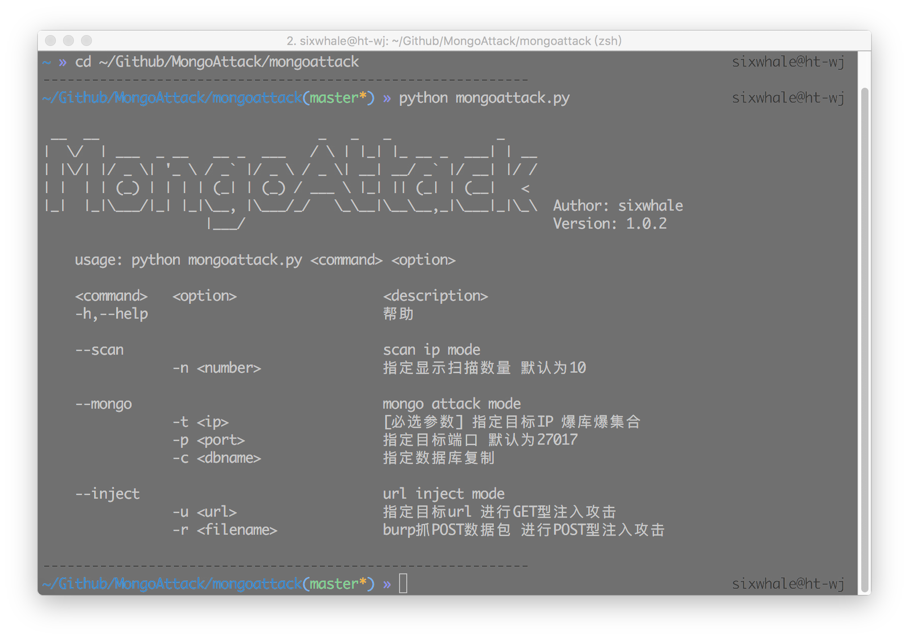

# MongoAttack
> 基于python2.7.x 的mongoDB攻击工具

## Usage
### 启动:
```
$ cd mongoattack/
$ python mongoattack.py
```
### 依赖:
```
getopt
shodan 
requests
urllib2
urllib
``` 
### 效果图:


## Status：
### 已完成：
* **shodan 扫描mongo主机**
* **指定主机进行列库列集合**
* **克隆指定数据库**

### 未完成：
* **--inject 模块**
* ......( 暂时还没想好 有想法的同学可以私聊 prpr


bug肯定是有的 一点一点de (= =b
email: wjsixwhale#gmail.com


